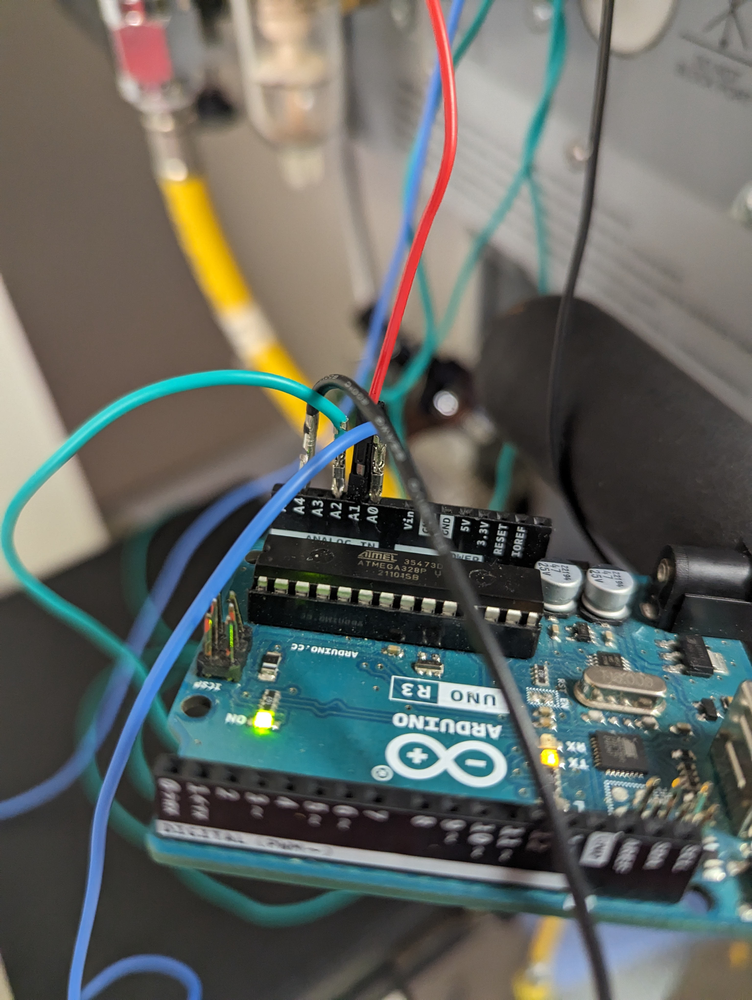

 
<link rel="stylesheet" href="/info/_css/dashboard.css">

<header class="dashboard-header">
<h1>How to Hack a Mechanical Ventilator to Export the Waveforms Using an Arduino</h1>
<h2>Mechanical Ventilator Waveforms from an AVEA CareStation</h2>
<h3>Information never Needs to Cost Anything</h3>    

  <figure class="image-container"><figcaption>Figure 1: Arduino Uno setup used for data collection</figcaption></figure>
  <figure class="image-container"><figcaption>Figure 2: RS-232 pin configuration for Avea ventilator</figcaption></figure>
  <figure class="image-container"><figcaption>Figure 3: Complete ventilator to Arduino connection setup</figcaption></figure>

<header>
  <h3>Data Collection Overview</h3>
  

    The data was collected using an Arduino Uno to perform analog readings of voltages from the RS-232 data pins by inserting a DuPont pin into the RS-232 connector. Each reading was recorded to a CSV file as a row, resulting in over 15,000 samples captured over 15 seconds. The parsed dataset shown on this page represents raw ventilator sensor outputs. There are 4 distinct sensor outputs from the AVEA Carestation in particular. These are the Pressure, Flow, Volume and Phase Waveforms. The sensor readings are converted to a numerical range to be easily exported. Please hit the play button below.
  

  

    Manufacturers typically restrict access to this kind of data, as ventilator systems often cost upwards of $50,000. Additional costs are added on for exporting data in this manner that can be quite expensive. In addition, the amount of people who can interpret these waveforms is limited to the Respiratory Therapy community which does not have a means to receive billing for analysis of these waveforms in a easily defined way.

  

    I do not know who originally developed the ventilator software and hardware beyond the publicly available service manuals. If you have information about the creators, please contact me on GitHub so I can add proper citations.
  

  

    <strong>Reference:</strong> 
    CareFusion. (n.d.). <cite>AVEA® Ventilator System Service Manual</cite> (Rev. D), Chapter 11: Appendices, pp. 244–246.
  

</header>

  

    

      <button id="playBtn">▶ Play</button>
      <button id="stopBtn">⏹ Stop</button>
      <button id="slowBtn">⏪ Slow Down</button>
      <button id="fastBtn">⏩ Speed Up</button>
      <button id="reverseBtn">⏪ Reverse</button>
      Speed: 1x
    

  

  

    
<h4 class="chart-title">All Charts</h4>
<canvas id="timeSeriesChart"></canvas>

    
<h4 class="chart-title">Flow Vs. Time</h4>
<canvas id="timeSeriesChartFlow"></canvas>

    
<h4 class="chart-title">Pressure Vs. Time</h4>
<canvas id="timeSeriesChartPressure"></canvas>

    
<h4 class="chart-title">Volume Vs. Time</h4>
<canvas id="timeSeriesChartVolume"></canvas>

    
<h4 class="chart-title">PV Loop (Pressure vs Volume)</h4>
<canvas id="PVLoop"></canvas>

    
<h4 class="chart-title">FV Loop (Flow vs Volume)</h4>
<canvas id="FVLoop"></canvas>

    
<h3>Current Data Stream</h3><table id="dataTable">
        <thead><tr id="tableHeader"></tr></thead><tbody id="tableBody"></tbody></table>
    

  

  

