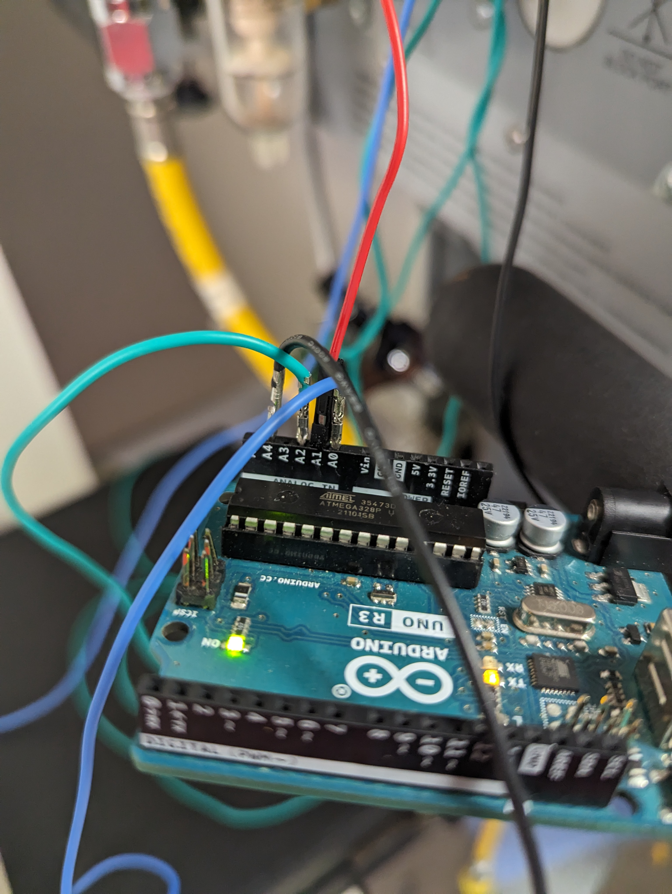
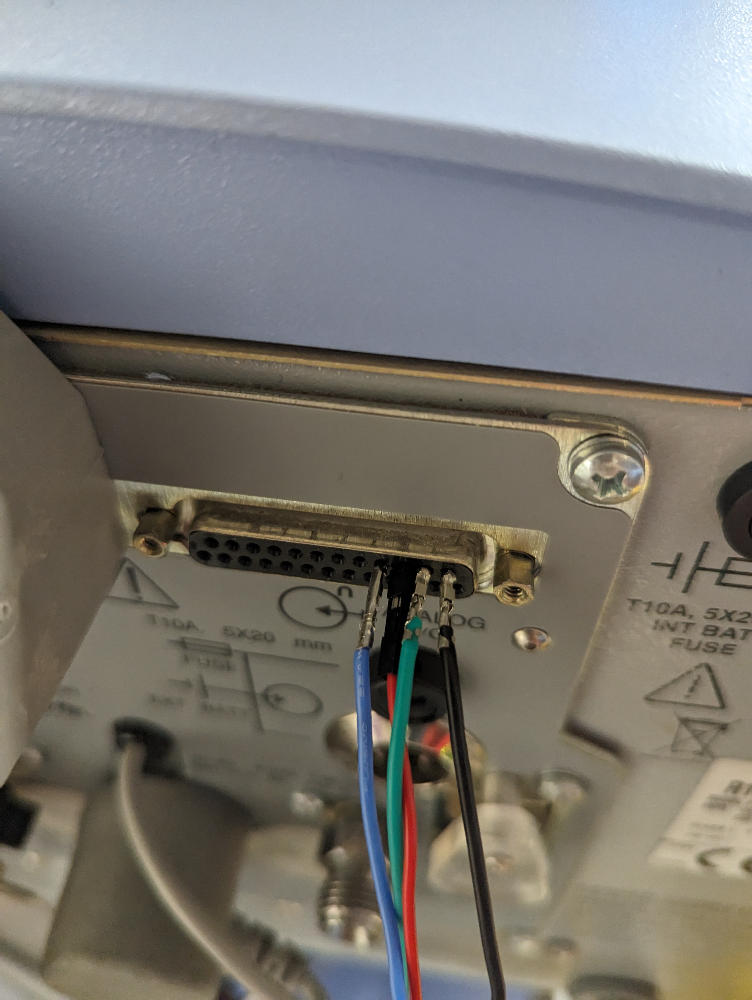
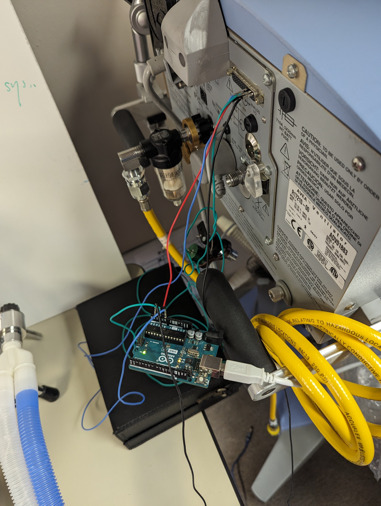

<link rel="stylesheet" href="/info/_css/dashboard.css">

<header class="dashboard-header">
<h1>Pauls Waveform Recording</h1>
<h2>I forgot where exactly I recorded this as I have a few recordings of Mechanical Ventilator Waveforms but this is what you would expect to see.</h2>
    

  <figure class="image-container"><figcaption>Figure 1: Arduino Uno setup used for data collection</figcaption></figure>
  <figure class="image-container"><figcaption>Figure 2: RS-232 pin configuration for Avea ventilator</figcaption></figure>
  <figure class="image-container"><figcaption>Figure 3: Complete ventilator to Arduino connection setup</figcaption></figure>

<h3>The data was collected by using a Arduino Uno to perform a Analog Read of the voltages from the RS-232 Data Pins by sticking a DuPont Pin into the RS-232 Pin Holes. This was then written to a CSV for every reading recorded. This was then parsed and loaded for working with at this page. This is the raw ventilator sensor data. This is what the ventilator manufacturers DONT want you to be able to collect.</h3>
<h3>By exporting the data this way, you are essentially making a data table for each patient that is hooked up the ventilator for raw values. These raw values can then be processed by each individual facility according to their institutions metric for counting breaths. Currently, this is handled by the manufacturers but due to the rapid expansion of ventilator manufacturers has allowed for independent development of Ventilator Sensor Data Interpretation.</h3>
<h3>I have no idea who made Mechanical Ventilators. If I could find out who coded all of this beyond the service manual, I would gladly cite them, if you know who made these devices, let them know to contact me on GitHub so I can update this citation.</h3>
<h3>CareFusion. (n.d.). <cite>AVEA® ventilator system service manual</cite> (Rev. D) [Service manual]. Chapter 11: Appendices, pp. 244–246.</h3>
<h4>There is no other citation to give honestly. I only needed this single source to create what is below. From here, I will continue to use discrete Mathematics and Real Time Operating Systems to demonstrate what is going on with the Mechanical Ventilator as well as some other random stuff on this website. I will cite things that are absolutely necessary when I encounter them.</h4>
</header>

  

    

      <button id="playBtn">▶ Play</button>
      <button id="stopBtn">⏹ Stop</button>
      <button id="slowBtn">⏪ Slow Down</button>
      <button id="fastBtn">⏩ Speed Up</button>
      <button id="reverseBtn">⏪ Reverse</button>
      Speed: 1x
    

  

  

    
<h4 class="chart-title">All Charts</h4>
<canvas id="timeSeriesChart"></canvas>

    
<h4 class="chart-title">Flow Vs. Time</h4>
<canvas id="timeSeriesChartFlow"></canvas>

    
<h4 class="chart-title">Pressure Vs. Time</h4>
<canvas id="timeSeriesChartPressure"></canvas>

    
<h4 class="chart-title">Volume Vs. Time</h4>
<canvas id="timeSeriesChartVolume"></canvas>

    
<h4 class="chart-title">PV Loop (Pressure vs Volume)</h4>
<canvas id="PVLoop"></canvas>

    
<h4 class="chart-title">FV Loop (Flow vs Volume)</h4>
<canvas id="FVLoop"></canvas>

    
<h3>Current Data Stream</h3><table id="dataTable">
        <thead><tr id="tableHeader"></tr></thead><tbody id="tableBody"></tbody></table>
    

  

  

